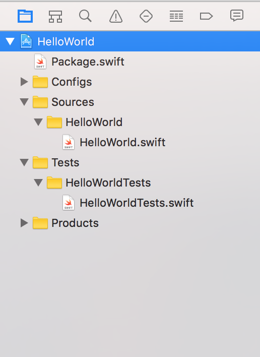
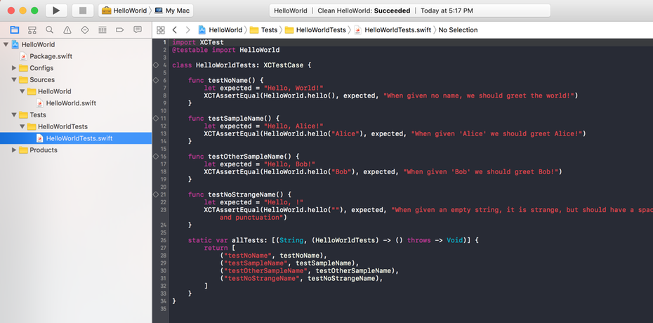
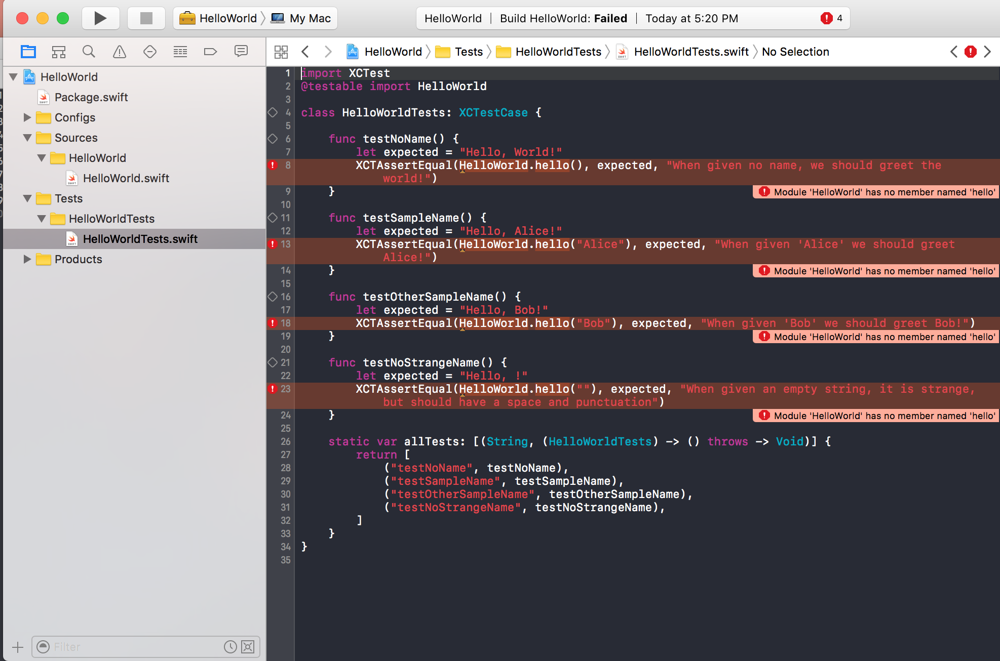
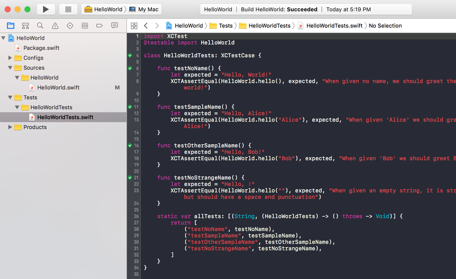

## Testing Tutorial

This guide explains how to run unit tests for Exercism Swift exercises, and optionally how to use Xcode for development.

Exercism uses [Swift Package Manager](https://github.com/apple/swift-package-manager/tree/master/Documentation) to package files and tests for Swift.

These instructions are written with the expectation that some readers will be very new to Xcode. Therefore each step is described in excruciating detail.

### Overview

To complete an Exercism exercise, you will work primarily with two files:

* **Swift Source** (hello-world/Sources/HelloWorld.swift). This is the file you will create to hold your source code and it is the file you will submit to Exercism.
* **Test Source** (hello-world/Tests/HelloWorldTests/HelloWorldTest.swift). This file is provided by Exercism. It contains the XCTestCase subclass that defines the solution to the exercise. You never edit this file, but you will have to understand it in order to fulfill its expectations. This is also the file where you will trigger the tests and interpret the results.

Optionally, you can create a third file for experimentation:
* **Playground** (MyPlayground.playground) is a scratchpad for drafting code snippets and playing with ideas. The code executes as you type, providing instant feedback.

### Running Tests
To run the tests, first `cd` to the directory for an exercise (for example, ~/exercism/swift/exercises/hello-world/), then execute `swift test` in the Terminal.  This will compile the files in the Sources directory and execute the tests in the Tests directory.  

### Xcode Projects
You can edit Swift files in any text editor, but many will prefer to use Xcode.  You can generate an Xcode project by executing `swift package generate-xcodeproj`.  This creates an Xcode project in the current directory.

## Running Tests with Xcode

Open the project generated by `swift package generate-xcodeproj`.

At this point the project's file inspector should look similar to the image on the left. If the `HelloWorldTests` folder is closed, click on the disclosure triangle to reveal its contents.

Select the test file from the file inspector.  You can trigger tests by clicking on one of the diamonds in the gutter of the Tests Source file. The diamond next to the class definition will run all the tests, whereas the diamond next to each individual test will run only that test.

Tests can also be invoked with Command-U, from the Test Inspector (Command-5), or from the sub-menu under the play button in the top bar.  Red errors are likely at this stage, and normal.

Once all the tests are marked with a green icon, congratulations, you have successfully completed the exercise! Now submit it to the Exercism website for review. If you are impossibly stuck, submit the exercise before it is complete to view how other users solved the exercise.

*The Hello-World exercise is a very simple coding problem, but the complexity of Xcode can make even simple exercises complex.  We can ignore most of this complexity, because we only need to edit one file.  You can always regenerate the Xcode project if something goes wrong.*

## Playgrounds

Playgrounds can be useful for brainstorming solutions to the problem.  The playground continuously evaluates code as you type, displaying variable states and results as you type.

If you generated an Xcode project, follow these steps:

1. First, make sure to select the topmost item in the File Inspector, the item marked with a blue icon that represents the project file.
2. Press Command-N and choose Playground from the template chooser. Click Next, and click Create.

Keep in mind that while playgrounds are useful for drafting code snippets and ideas, code must be moved to the Swift Source file for testing and submission.

### How Tests Are Used

Test driven development is a very iterative process. The first step is to successfully run the tests (see the next section), and have them fail. Remember that the exercise can be solved with code in the application source file alone. Enter your solution into the Swift Source file. Xcode will continuously update the display with errors that highlight code that will not compile.

One approach begins with creating a method that returns a correct hard coded value to at least the first test in order for the project to compile. This should confirm that you have created the classes or structs that the tests require. Next, create code that generates the expected return value and test again. Keep repeating this basic cycle until all the tests pass.

### Submission

1. In the Terminal, navigate to the folder that contains the application source file. In this example, the path would be `~/exercism/swift/hello-world/HelloWorld/HelloWorld/`
2. To submit, type `exercism submit HelloWorld.swift` (_Alternatively, you can submit by using the file name with the full path from any directory. A second alternative is to locate the file you need to submit in the Finder. Open the Terminal, type exercism submit followed by a space, then drag the file from the Finder into the Terminal and press return._)
3. Once uploaded, a URL will appear that reveals your solution on the Exercism web site.
4. The Exercism CLI allows files to be submitted more than once, and each successive iteration will be added alongside the original.

To review:

* **HelloWorld.swift** is the Swift Source code file where you code the solution and later submit it to Exercism.
* **HelloWorldTest.swift** is the Test Source code file provided by Exercism. It contains the tests that define the exercise.
* **MyPlayground.playground** is for drafting code snippets and playing with ideas.

### Participate in Code Reviews

After you submit a file, follow the URL presented to show the submission on the web. Bookmark it for future reference. From your submission page you can view how others solved the same problem.

### More Information

XCTestCase is the XCTest subclass that contains the test's methods and XCTAssert lines are the expected results. The results are different types depending on how the test is designed.

There is a lot more to learn more about Test Driven Development, XCTAssert Methods and XCTestCase. Unfortunately up-to-date Swift documentation on these topics is short-lived. Although out of date as of when this tutorial was last updated, this curated list of sources contains useful information:

[Apple's Guide on XCTest](https://developer.apple.com/library/tvos/documentation/DeveloperTools/Conceptual/testing_with_xcode/chapters/02-quick_start.html#//apple_ref/doc/uid/TP40014132-CH2-SW1)

[XCTest​Case / XCTest​Expectation / measure​Block()](http://nshipster.com/xctestcase/)

A list of [Assertions supported in XCTest](http://rshankar.com/assertions-supported-in-xctest/).

[Getting Started with TDD in Swift 2.0](https://medium.com/@ynzc/getting-started-with-tdd-in-swift-2fab3e07204b#.589p6ao6y)

